<p align="center">
  
</p>

<p align="center">
  
  
  
  
</p>

**J-Master** turns a raw AI-generated track (a SUNO export, a bounce, any WAV) into a
release-ready master. Load it, and the console tells you the tempo, the song's
sections, where it runs hot, and what's wrong with it. Shape it with eight
macro processors, or press one button and watch the analysis do it, with
every decision shown. Export at an exactly-solved loudness for any streaming
platform, tagged, in four formats, or assemble a whole album into a
replication-ready CD image. Everything runs locally. Nothing leaves your machine.

Built by **[JMW Software](https://www.jmwsoftware.com.au)** for
**[Jamware Records](https://www.jamwarerecords.com)**. *Music, manufactured.*

<p align="center">
  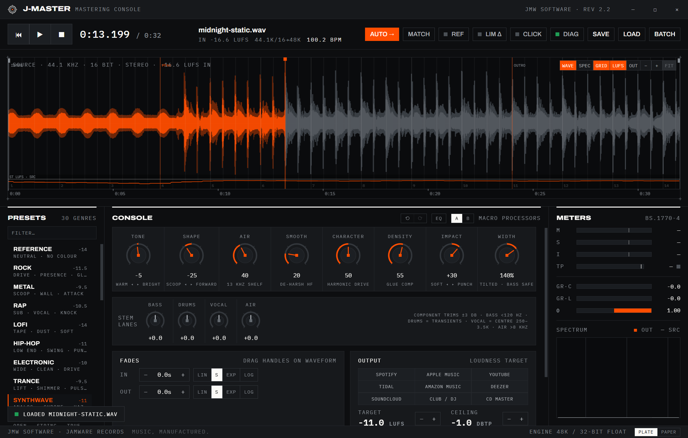
</p>

---


Eight macro processors, tuned so that every knob does something musical and
none of them can ruin your track:

| Macro | What it does |
|---|---|
| **TONE** | Warm ↔ bright spectral tilt, ±4.5 dB around 700 Hz |
| **SHAPE** | Scooped ↔ forward mid contour (presence vs. wall-of-sound) |
| **AIR** | 13 kHz shelf, up to +6 dB of sheen |
| **SMOOTH** | *Dynamic* high-band tamer that cuts harsh AI-generation zing only when it appears; transparent otherwise |
| **CHARACTER** | 4× oversampled tanh saturation with even-harmonic bias for tape/tube colour at unity small-signal gain |
| **DENSITY** | Slow glue compression with auto-makeup: thickness, not pumping |
| **IMPACT** | Transient contour: soften ↔ punch, ±6 dB on attacks |
| **WIDTH** | Stem-aware tilted M/S: bass anchored below 140 Hz, mids widened gently, highs opened most |

Plus **BALANCE** with one-click **AUTO-CENTER**, four **STEM LANES**
(bass / drums / vocal / air component trims at ±3 dB of phase-coherent DSP
extraction, with the lane interface ready for a neural separator), a 6-band
**advanced parametric EQ** drawer with draggable handles over the live
spectrum, loudness-matched **REF** bypass, **LIM Δ** (hear only what the
limiter removes), full **undo/redo**, and **A/B snapshot slots**.

<p align="center">
  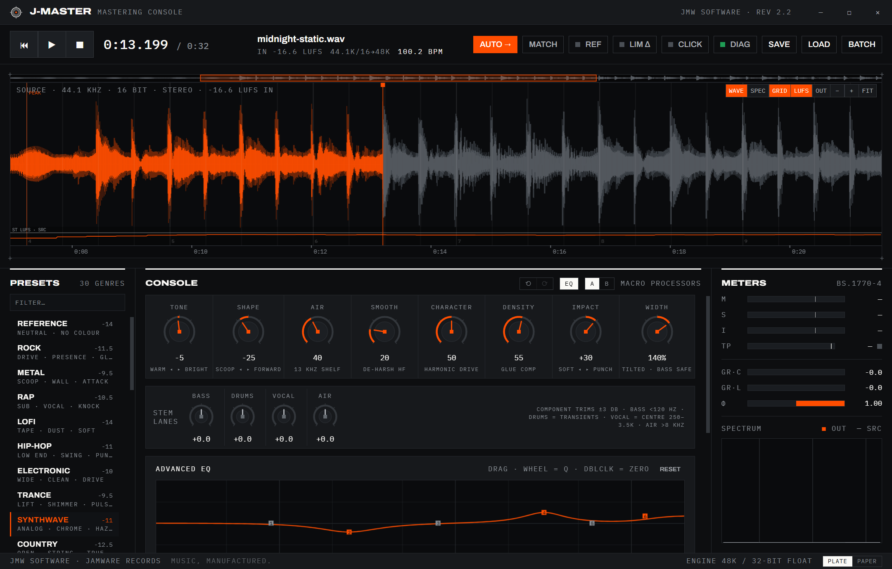
</p>

---


Every load runs a full analysis pass:

- **Tempo detection:** spectral-flux onsets → autocorrelation, phase-locked
  to kick and bass. Drives a bar/beat **GRID** overlay and a **CLICK**
  metronome (mixed in after metering; never exported).
- **Section detection:** checkerboard novelty over band energies finds
  INTRO / PEAK / OUTRO boundaries, snapped to bars, which also anchors
  bar 1 to the music.
- **Track diagnosis:** a check sheet tuned to AI-music pathologies: bass
  smeared into the sides, phasey width (windowed correlation), image lean,
  harsh highs. Found issues open with measured values and pre-checked
  one-click fixes. Nothing is ever applied silently unless you arm
  **AUTO-FIX ON LOAD**.
- **Dynamics report:** PLR, EBU R128 loudness range, and a delivery table
  showing exactly what Spotify / Apple / YouTube / Tidal normalization will
  do at your current target.
- **AUTO →:** the one-button master. Picks a genre preset from tempo and
  spectral signature, applies the diagnosed fixes, sets a target, and shows
  its complete reasoning on a report card, with one button to undo the lot.
- **MATCH:** load a reference track you trust; its tonal balance, loudness
  and width are measured against your source and a capped ±6 dB correction
  curve is applied in one click.

<p align="center">
  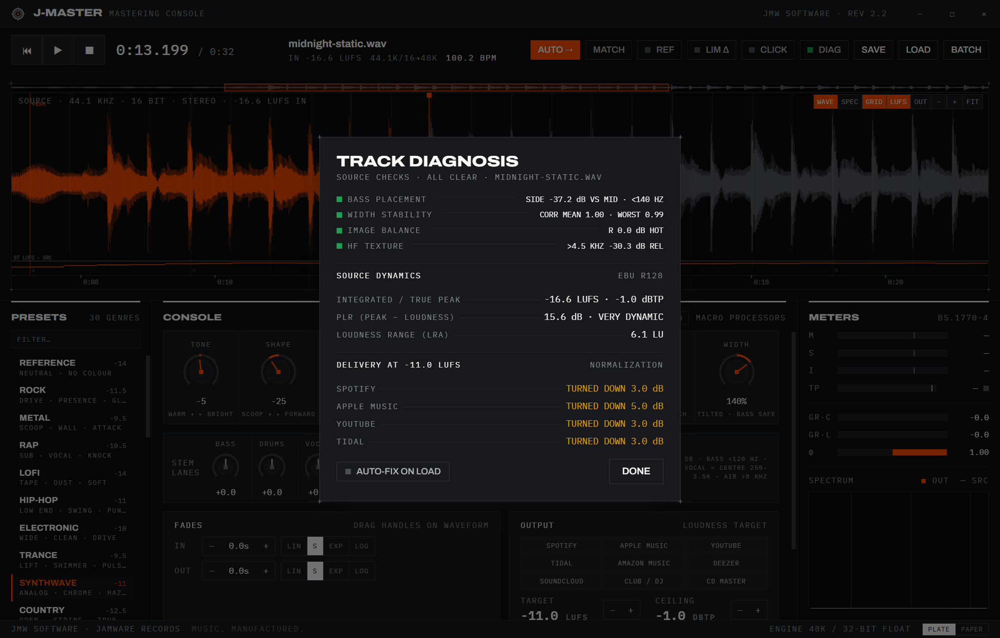
</p>

The waveform is a workspace: wheel-zoom to transient level, drag fade handles
with four curve shapes, and flip to a log-frequency **spectrogram** that
shares the same zoom, grid, playhead and loudness lane:

<p align="center">
  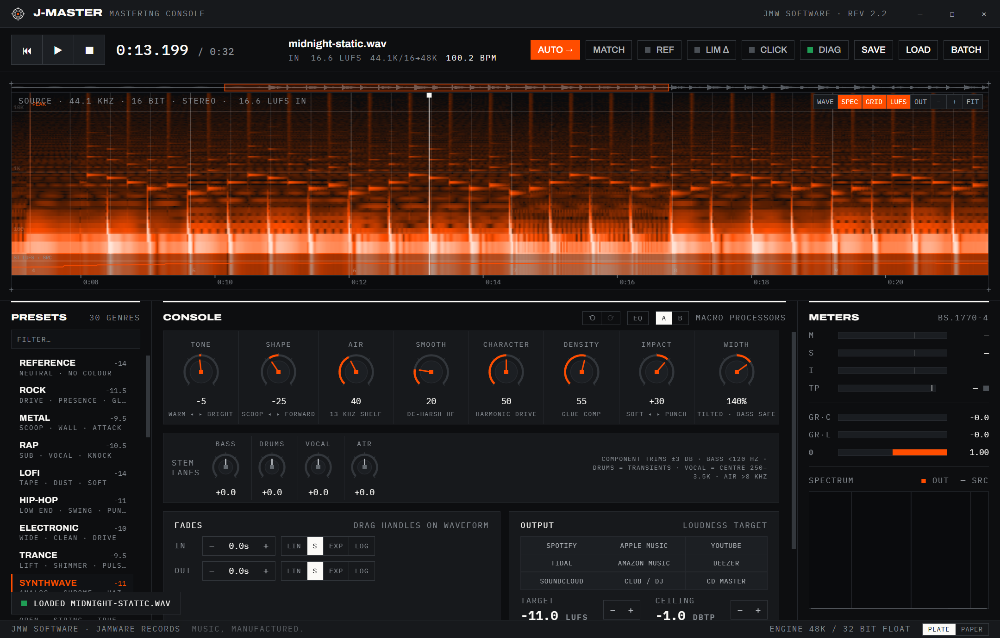
</p>

---


The export pipeline solves loudness *exactly*: measure → gain → true-peak
limit → verify, iterating until the master lands within 0.15 LU of target
with the ceiling held in dBTP.

| Format | Engine | Notes |
|---|---|---|
| **WAV** | in-house | 48 kHz, 24/16-bit, TPDF dither, RIFF INFO tags |
| **FLAC** | **in-house (RFC 9639)** | per-frame stereo decorrelation, LPC to order 12, partitioned Rice; verified bit-exact lossless |
| **MP3** | lamejs (LGPL) | 320/256/192 CBR, ID3v2.3 tags |
| **Ogg Opus** | **WebCodecs + in-house RFC 7845 muxer** | 256/192/128 kbps, OpusTags metadata, zero dependencies |

- **Release metadata** on every export: title, artist, album, year, genre,
  catalog number, written in the native tag format per container.
- **Codec audition:** loop the loudest section and A/B the actual encoded
  result against the lossless master before you commit.
- **Batch albums:** queue tracks, reorder, per-track preset overrides and
  per-track diagnosed fixes, auto-numbered tags.
- **Album / CD assembly:** a replication-ready 44.1 kHz/16-bit image WAV
  (frame-aligned tracks, configurable gaps, streamed to disk) with a CUE
  sheet carrying CD-TEXT, per-track ISRCs and album UPC, plus a manifest.
- **Projects:** save the whole session as a `.jmaster` file; double-click
  to reopen exactly where you left off.

<p align="center">
  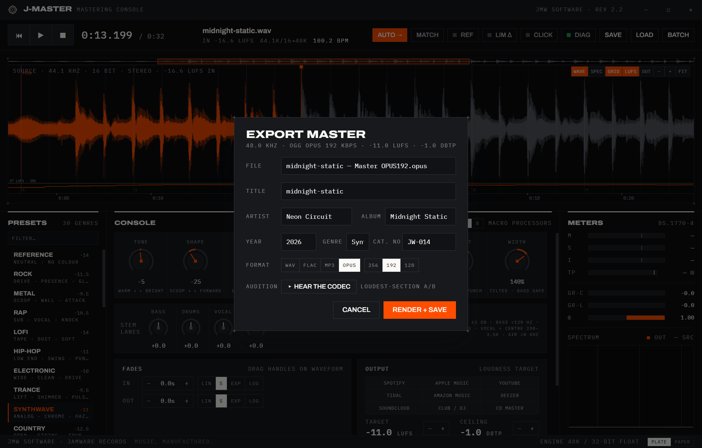
</p>

Two themes, both from the Jamware Records design system: **PLATE** (the
mastering floor at night) and **PAPER** (the spec sheet):

<p align="center">
  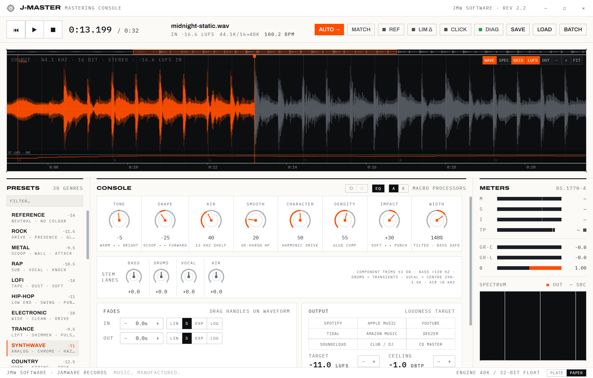
</p>

---


The core guarantee is **WYSIWYG audio**: the real-time preview worklet and
the offline export renderer run the *same* TypeScript DSP code, and preview
gain is auto-calibrated against the loudest section of the track, so what
you hear is what renders.

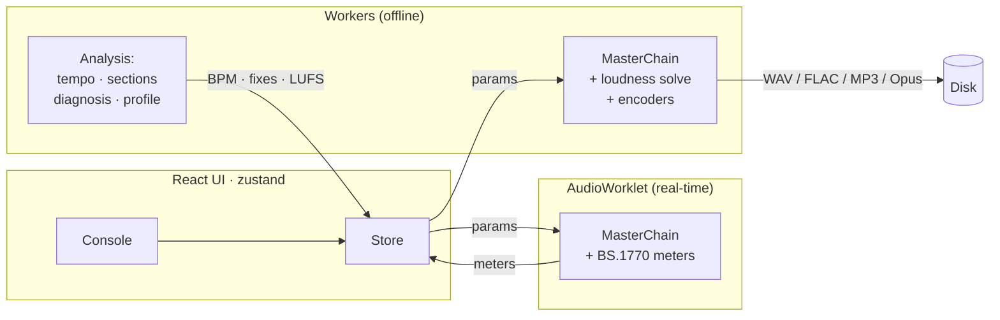

`src/audio/dsp/` is the shared engine: RBJ biquads, a 4× oversampled
saturator, glue compressor, transient shaper, stem lanes, tilted M/S width,
dynamic de-harsh, lookahead true-peak limiter, and a full BS.1770-4
implementation (K-weighting, gated integration, LRA, true peak). The FLAC
encoder and the Ogg Opus muxer are written from scratch in this repo: no
WASM blobs, no native modules.

Deeper details live in [docs/ARCHITECTURE.md](docs/ARCHITECTURE.md).

---


Every DSP claim in this project was verified by measurement during
development, using a scriptable hook (`window.__jmaster`) that drives the
real app:

| Claim | Measured |
|---|---|
| Export hits loudness target | −11.58 LUFS on a −11.5 target |
| FLAC is lossless | 0 errors across full decode roundtrips (incl. LPC + M/S frames) |
| True-peak ceiling held | −0.98 dBTP against a −1.0 ceiling |
| BPM detection | 100.24 detected on a 100.00 ground-truth track |
| Opus loudness through codec | −11.63 LUFS decoded vs −11.5 target |
| CD image frame alignment | track 2 INDEX at exactly 00:34:00 for 32 s + 2 s gap |
| Balance correction | +2.03 dB measured on a +2.02 dB expected shift |

---


```bash
npm install
npm run dev        # renderer in a browser (http://localhost:5183)
npm run dev:app    # full Electron app against the Vite dev server
npm run dist       # Windows x64 installer + portable exe → release/
npm run dist:arm64 # Windows ARM64 builds (no native modules, same JS)
```

Requires Node 20+. The renderer also runs standalone in a Chromium browser
(file input + download fallback), which is how the automated verification
drives it. Screenshot and banner assets regenerate with
`node scripts/make-banners.mjs` and `node scripts/capture-screens.mjs`.

> **Windows packaging note:** if electron-builder fails with `EPERM` renaming
> `win-unpacked.tmp`, something (usually an editor's file watcher) is holding
> directory handles in the project tree. Build to an outside folder:
> `npx electron-builder --win --x64 "-c.directories.output=%TEMP%\jm-release"`

---


**GPL-3.0:** see [LICENSE](LICENSE).

Copyright © 2026 **JMW Software** and **Jamware Records**. J-Master is
genuinely open source; copyleft keeps derivatives open, while all copyright
in the software, its design language, and the J-Master / JMW Software /
Jamware Records names and marks remains with the companies. The GPL covers
the code; it does not grant rights to the brand.

Third-party notice: MP3 encoding uses
[@breezystack/lamejs](https://www.npmjs.com/package/@breezystack/lamejs)
(LGPL-3.0). All other DSP, the FLAC encoder, and the Ogg Opus muxer are
original to this repository. UI set in the Jamware Records design language
(Archivo + IBM Plex Mono, bundled under the Open Font License).

<p align="center">
  <sub>JMW SOFTWARE · JAMWARE RECORDS · MUSIC, MANUFACTURED.</sub>
</p>
