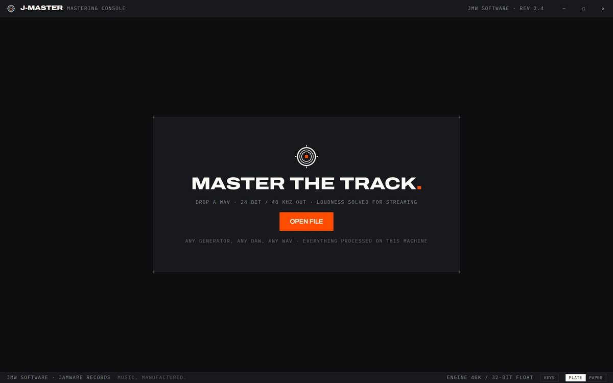
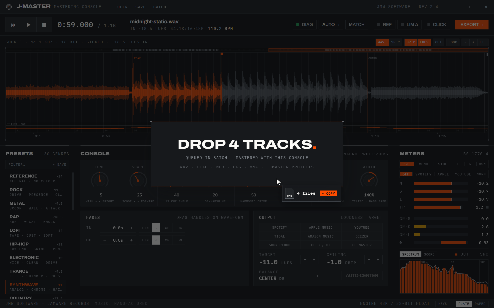
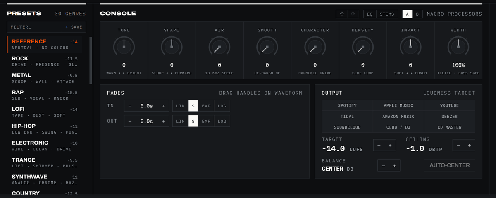
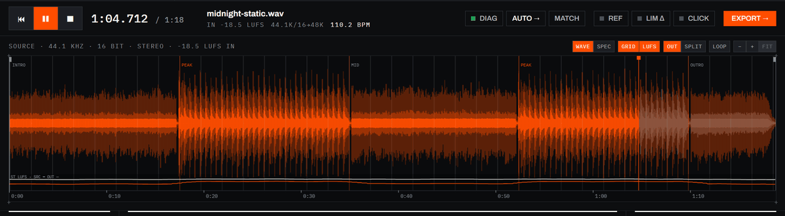
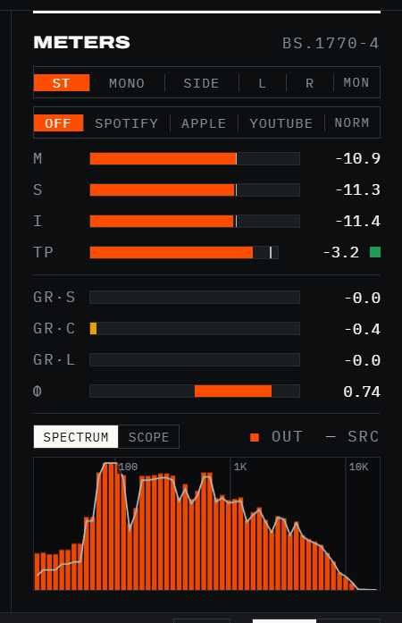
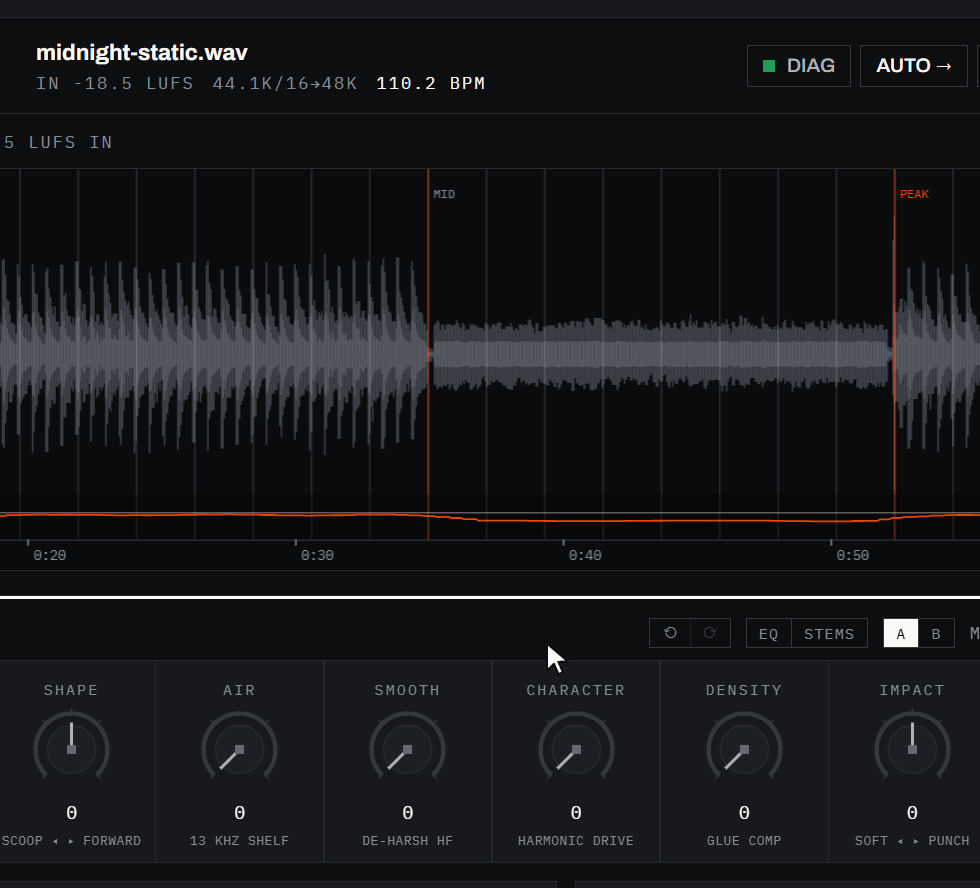
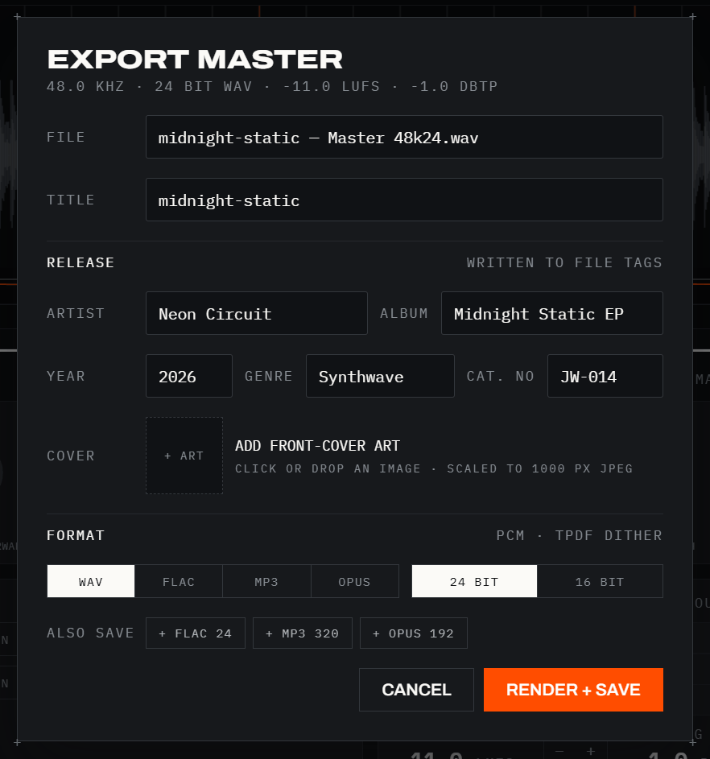
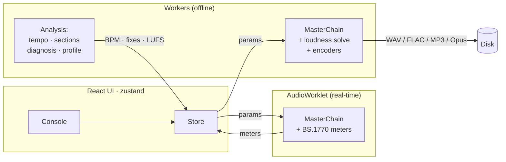

<p align="center">
  
</p>

<p align="center">
  <b>Turn a raw AI-generated track, or any WAV, into a release-ready master.</b><br/>
  Every decision shown. Loudness solved exactly. Nothing leaves your machine.
</p>

<p align="center">
  <a href="https://github.com/Jared-woodruff/J-Master/releases/latest"></a>
</p>

<p align="center">
  <a href="https://github.com/Jared-woodruff/J-Master/releases/latest"></a>
  
  
  
</p>

<p align="center">
  
  <br/><sub>Drop a track in. It's decoded, measured, and split into sections in about a second.</sub>
</p>

**J-Master** is a desktop mastering console for Windows. It was built for the
output of AI music generators (SUNO, Udio, Riffusion, or local models like
MusicGen and Stable Audio), and it masters any WAV from any source, DAW
bounces included. Load a track and the console reads its tempo and its
sections, and checks it for the problems AI music tends to have. Shape it
with eight macro processors, or press one button and let the analysis do it,
with every decision shown. Then export at an exactly solved loudness for any
streaming platform, tagged and with cover art, in several formats at once, or
assemble a whole album into a replication-ready CD image.

Built by **[JMW Software](https://www.jmwsoftware.com.au)** for
**[Jamware Records](https://www.jamwarerecords.com)**. *Music, manufactured.*

<table>
  <tr>
    <td width="33%" valign="top"><b>Exact loudness</b><br/><sub>Measure, gain, true-peak limit, verify. Every export lands within 0.15 LU of its target with the ceiling held.</sub></td>
    <td width="33%" valign="top"><b>Every decision shown</b><br/><sub>AUTO masters in one click and prints its reasoning. One more click undoes all of it.</sub></td>
    <td width="33%" valign="top"><b>Honest monitoring</b><br/><sub>Split compare, section loop, loudness-matched bypass, mono and side checks, platform playback levels, a vectorscope.</sub></td>
  </tr>
  <tr>
    <td valign="top"><b>One render, every format</b><br/><sub>WAV, FLAC, MP3 and Ogg Opus with release tags and embedded cover art, several from a single pass.</sub></td>
    <td valign="top"><b>Whole albums</b><br/><sub>Drop a stack of tracks into BATCH, or assemble a CD image with a CUE sheet, ISRCs and CD-TEXT.</sub></td>
    <td valign="top"><b>Local and open</b><br/><sub>No account, no upload, no cloud. GPL-3.0, with the DSP, FLAC encoder and Opus muxer written in this repo.</sub></td>
  </tr>
</table>

<table>
  <tr>
    <td width="50%"></td>
    <td width="50%"></td>
  </tr>
  <tr>
    <td align="center"><sub><b>PLATE</b> · the mastering floor at night</sub></td>
    <td align="center"><sub><b>PAPER</b> · the spec sheet</sub></td>
  </tr>
</table>

<p align="center">
  <a href="#drop">Drop it in</a> ·
  <a href="#shape">Shape it</a> ·
  <a href="#listen">Hear it</a> ·
  <a href="#analysis">Let it listen</a> ·
  <a href="#ship">Ship it</a> ·
  <a href="#engine">Under the hood</a> ·
  <a href="#proof">Proof</a> ·
  <a href="#get">Get it</a> ·
  <a href="#license">License</a>
</p>

<a id="drop"></a>


Drop a track anywhere on the window. Before you let go, a veil says exactly
what the drop will do:

- **One track** loads into the console, and your console settings carry over
  to it.
- **Several tracks** queue in BATCH, mastered with the console as it stands.
  If the console is empty, the first one opens there too.
- **On MATCH**, a track becomes the reference. **On EXPORT or BATCH**, an
  image becomes the cover art.

Loading shows the file name and each analysis phase as it runs, and a file
that can't be decoded leaves the current track untouched. WAV, FLAC, MP3, OGG
and M4A all load; the last six tracks reopen with one click from the start
screen, and a `.jmaster` project restores a whole session.

<p align="center">
  
</p>

<a id="shape"></a>


<p align="center">
  
  <br/><sub>Pick a genre, tweak it (the rack marks it MODIFIED and offers REVERT), then keep it as your own.</sub>
</p>

Eight macro processors, tuned so that every knob does something musical and
none of them can ruin your track:

| Macro | What it does |
|---|---|
| **TONE** | Warm to bright spectral tilt, ±4.5 dB around 700 Hz |
| **SHAPE** | Scooped to forward mid contour (presence against wall-of-sound) |
| **AIR** | 13 kHz shelf, up to +6 dB of sheen |
| **SMOOTH** | *Dynamic* high-band tamer that cuts harsh AI-generation zing only when it appears; transparent otherwise |
| **CHARACTER** | 4× oversampled tanh saturation with even-harmonic bias for tape and tube colour at unity small-signal gain |
| **DENSITY** | Slow glue compression with auto-makeup: thickness, not pumping |
| **IMPACT** | Transient contour from soften to punch, ±6 dB on attacks |
| **WIDTH** | Stem-aware tilted M/S: bass anchored below 140 Hz, mids widened gently, highs opened most |

Thirty genre presets start you off, and **+ SAVE** keeps the console
(macros, target, ceiling, genre) as a preset of your own, listed above the
genres and selectable per track in BATCH. Around the macros sit **BALANCE**
with one-click **AUTO-CENTER**, four **STEM LANES** (bass, drums, vocal and
air trims of ±3 dB with phase-coherent extraction), a 6-band **advanced
parametric EQ** drawer with draggable handles over the live spectrum,
**A/B snapshot slots**, and full **undo and redo**. Click any knob's readout
to type an exact value, and hover one to learn what it does.

<p align="center">
  
</p>

<a id="listen"></a>


<p align="center">
  
  <br/><sub>SPLIT puts the source above the master on one timeline; LOOP cycles the section you're working on.</sub>
</p>

<table>
  <tr>
    <td width="300" valign="top"></td>
    <td valign="top">

**Listen the way your audience will.**

- **OUT** renders the master as you adjust, and **SPLIT** stacks it under
  the source so the difference is visible at a glance.
- **LOOP** (<kbd>L</kbd>, or double-click the waveform) cycles the detected
  section under the playhead, sample-seamless.
- **REF** is a loudness-matched bypass: tap <kbd>R</kbd> to switch, hold it
  for a momentary compare.
- **LIM Δ** plays only what the limiter removes.
- **MON** folds to mono, solos the side, or plays one channel, and the
  meters read exactly what you hear.
- **NORM** turns playback down as Spotify, Apple Music or YouTube would at
  your target, so a louder master and a more dynamic one can be judged at
  the level listeners get. Playback only; exports are untouched.
- **SCOPE** plots the stereo image: mono is a vertical line, width spreads
  it, and phase trouble leans toward horizontal.

</td>
  </tr>
</table>

The waveform is a workspace too: wheel-zoom to transient level, drag the fade
handles (four curve shapes), overlay the bar and beat **GRID** with a
**CLICK** metronome, and flip to a log-frequency **spectrogram** that shares
the same zoom, grid, playhead and loudness lane.

<p align="center">
  
</p>

<a id="analysis"></a>


<p align="center">
  
  <br/><sub>One click on AUTO: a preset chosen from the analysis, a target set, and every reason on the card.</sub>
</p>

Every load runs a full analysis pass:

- **Tempo detection:** spectral-flux onsets and autocorrelation, phase-locked
  to kick and bass. It drives the bar and beat **GRID** and the **CLICK**
  metronome (mixed in after metering and never exported).
- **Section detection:** checkerboard novelty over band energies finds the
  boundaries, snaps them to bars (which also anchors bar 1 to the music), and
  labels each section by energy: INTRO, LOW, MID, PEAK, OUTRO.
- **Track diagnosis:** a check sheet tuned to AI-music pathologies (bass
  smeared into the sides, phasey width, image lean, harsh highs). Issues open
  with measured values and pre-checked one-click fixes. Nothing is applied
  silently unless you arm **AUTO-FIX ON LOAD**.
- **Dynamics report:** PLR, EBU R128 loudness range, and a delivery table
  showing what Spotify, Apple Music, YouTube and Tidal normalization will do
  at your target.
- **AUTO →:** the one-button master. It picks a genre preset from tempo and
  spectral signature, applies the diagnosed fixes, sets a target, and shows
  its complete reasoning, with one button to undo the lot.
- **MATCH:** load a reference track you trust; its tonal balance, loudness
  and width are measured against your source and a capped ±6 dB correction
  curve is applied in one click.

<p align="center">
  
</p>

<a id="ship"></a>


<table>
  <tr>
    <td width="440" valign="top"></td>
    <td valign="top">

**One render, everything you deliver.**

The export pipeline solves loudness *exactly*: measure, gain, true-peak
limit, verify, iterating until the master lands within 0.15 LU of its target
with the ceiling held in dBTP.

- **ALSO SAVE** encodes extra formats from the same render and saves them
  beside the master: a WAV for distribution plus an MP3 for sharing is one
  loudness solve, one pass.
- **Cover art:** click or drop an image (scaled to a 1000 px JPEG) and it's
  embedded natively in every format.
- **Release tags:** title, artist, album, year, genre and catalog number,
  written in each container's own tag format.
- **Codec audition:** loop the loudest section and A/B the encoded result
  against the lossless master before you commit.

</td>
  </tr>
</table>

| Format | Engine | Notes |
|---|---|---|
| **WAV** | in-house | 48 kHz, 24 or 16-bit, TPDF dither, RIFF INFO tags |
| **FLAC** | **in-house (RFC 9639)** | per-frame stereo decorrelation, LPC to order 12, partitioned Rice; verified bit-exact lossless |
| **MP3** | lamejs (LGPL) | 320, 256 or 192 kbps CBR, ID3v2.3 tags |
| **Ogg Opus** | **WebCodecs + in-house RFC 7845 muxer** | 256, 192 or 128 kbps, OpusTags metadata, zero dependencies |

- **Cover art everywhere:** an ID3v2.3 APIC frame, a FLAC PICTURE block, Ogg
  Opus METADATA_BLOCK_PICTURE (the muxer spans pages when the art demands
  it), and a WAV `id3 ` chunk. Covers travel with projects and batch exports.
- **Batch albums:** queue tracks, reorder them, override presets per track,
  apply each track's diagnosed fixes, and number the tags automatically.
- **Album and CD assembly:** a replication-ready 44.1 kHz/16-bit image WAV
  (frame-aligned tracks, configurable gaps, streamed to disk) with a CUE sheet
  carrying CD-TEXT, per-track ISRCs and the album UPC, plus a manifest.
- **Projects:** save the whole session as a `.jmaster` file and double-click
  it to pick up exactly where you left off.

<a id="engine"></a>


The core guarantee is **WYSIWYG audio**: the real-time preview worklet and
the offline export renderer run the *same* TypeScript DSP code, and preview
gain is calibrated against the loudest section of the track, so what you
hear is what renders.



`src/audio/dsp/` is the shared engine: RBJ biquads, a 4× oversampled
saturator, glue compressor, transient shaper, stem lanes, tilted M/S width,
dynamic de-harsh, lookahead true-peak limiter, and a full BS.1770-4
implementation (K-weighting, gated integration, LRA, true peak). The FLAC
encoder and the Ogg Opus muxer are written from scratch in this repo: no
WASM blobs, no native modules. Deeper details live in
[docs/ARCHITECTURE.md](docs/ARCHITECTURE.md).

<a id="proof"></a>


Every claim here was verified by measurement during development, using a
scriptable hook (`window.__jmaster`) that drives the real app:

| Claim | Measured |
|---|---|
| Export hits its loudness target | −11.58 LUFS on a −11.5 target |
| True-peak ceiling held | −0.98 dBTP against a −1.0 ceiling |
| FLAC is lossless | 0 errors across full decode round trips (LPC and M/S frames included) |
| ALSO SAVE is one render | a WAV and a FLAC from one export differ in 0 samples; all three files −11.12 LUFS on a −11.0 target |
| Opus loudness survives the codec | −11.63 LUFS decoded against a −11.5 target |
| BPM detection | 100.24 on a 100.00 BPM test track; 110.18 on the 110.00 BPM demo track |
| Section detection | demo track boundaries at 17.5, 34.9, 52.4 and 69.8 s; its bar lines fall at 17.45, 34.91, 52.36 and 69.82 s |
| CD image frame alignment | track 2 INDEX at exactly 00:34:00 for a 32 s track plus a 2 s gap |
| Balance correction | +2.03 dB measured on a +2.02 dB expected shift |
| MON matrix is honest | correlation 1.00 in MONO; side solo −4.7 dB on a centred source |
| NORM previews the platform level | −3.1 dB measured on a −3.0 dB Spotify turn-down, with meters and renders unchanged |
| One drop, one engine | 1 audio context and 0 playhead jumps after a drop (before the fix: 2 contexts, 187 jumps) |
| Cover art survives every container | APIC, PICTURE and METADATA_BLOCK_PICTURE parsed back from real renders; 657 KB of art spans 13 Ogg pages and still decodes |
| Idle repaint cost | 3 s paused = 1 waveform draw and 0 spectrum draws (was about 180 and 540) |

<a id="get"></a>


**Download** the installer or the portable build, for x64 or ARM64, from the
[latest release](https://github.com/Jared-woodruff/J-Master/releases/latest).
The builds aren't code-signed yet, so Windows SmartScreen may warn on first
launch: choose **More info**, then **Run anyway**.

**Build from source** with Node 20 or newer:

```bash
npm install
npm run dev        # renderer in a browser (http://localhost:5183)
npm run dev:app    # full Electron app against the Vite dev server
npm run dist       # Windows x64 installer + portable exe → release/
npm run dist:arm64 # Windows ARM64 builds (no native modules, same JS)
```

The renderer also runs standalone in a Chromium browser (file input and a
download fallback), which is how the automated verification drives it.

<details>
<summary><b>Keyboard map</b> (press <kbd>?</kbd> in the app for the same sheet)</summary>
<br/>

| Action | Keys |
|---|---|
| Play / pause | <kbd>Space</kbd> |
| Return to start | <kbd>Home</kbd> |
| Seek 5 s / 30 s | <kbd>←</kbd> <kbd>→</kbd> / <kbd>Shift</kbd> + <kbd>←</kbd> <kbd>→</kbd> |
| Loop the section | <kbd>L</kbd> or double-click the waveform |
| Reference (untouched source) | <kbd>R</kbd>; hold for a momentary compare |
| A/B snapshot slot | <kbd>A</kbd> |
| Export | <kbd>E</kbd> |
| Save / open a project | <kbd>Ctrl</kbd> + <kbd>S</kbd> / <kbd>Ctrl</kbd> + <kbd>O</kbd> |
| Undo / redo | <kbd>Ctrl</kbd> + <kbd>Z</kbd> / <kbd>Ctrl</kbd> + <kbd>Y</kbd> |
| Fine knob drag | <kbd>Shift</kbd> + drag |
| Reset a knob | double-click, or <kbd>Home</kbd> |
| Type a knob value | click its readout |
| Zoom / pan the waveform | wheel / <kbd>Shift</kbd> + wheel |
| Load a track | drop it anywhere |
| Queue an album | drop several tracks |

</details>

<details>
<summary><b>Regenerating the README media</b></summary>
<br/>

Every screenshot and GIF on this page comes from the app itself, playing a
demo track synthesized by `scripts/make-demo-song.mjs` (a 110 BPM cue in
clean 8-bar sections). The capture scripts drive the production build with
real drops, clicks and keystrokes, on a throwaway profile with audio muted.

```bash
node scripts/make-banners.mjs      # animated banners; type set as vector paths
npm run build
node scripts/capture-screens.mjs   # screenshots
node scripts/capture-media.mjs     # GIFs (needs ffmpeg on PATH)
```

GitHub serves repository SVGs under a policy that blocks fonts, so the
banners set their type as paths from `scripts/banner-glyphs.json`, which
`scripts/build-glyph-atlas.py` extracts from the app's bundled fonts (only
needed when a banner uses a new character). Banner motion is CSS only and
stops for anyone with reduced motion turned on.

</details>

> **Windows packaging note:** if electron-builder fails with `EPERM` renaming
> `win-unpacked.tmp`, something (usually an editor's file watcher) is holding
> directory handles in the project tree. Build to an outside folder:
> `npx electron-builder --win --x64 "-c.directories.output=%TEMP%\jm-release"`

<a id="license"></a>


**GPL-3.0:** see [LICENSE](LICENSE).

Copyright © 2026 **JMW Software** and **Jamware Records**. J-Master is
genuinely open source; copyleft keeps derivatives open, while all copyright
in the software, its design language, and the J-Master, JMW Software and
Jamware Records names and marks remains with the companies. The GPL covers
the code; it does not grant rights to the brand.

Third-party notice: MP3 encoding uses
[@breezystack/lamejs](https://www.npmjs.com/package/@breezystack/lamejs)
(LGPL-3.0). All other DSP, the FLAC encoder, and the Ogg Opus muxer are
original to this repository. UI set in the Jamware Records design language
(Archivo and IBM Plex Mono, bundled under the Open Font License).

<p align="center">
  <sub>JMW SOFTWARE · JAMWARE RECORDS · MUSIC, MANUFACTURED.</sub>
</p>
